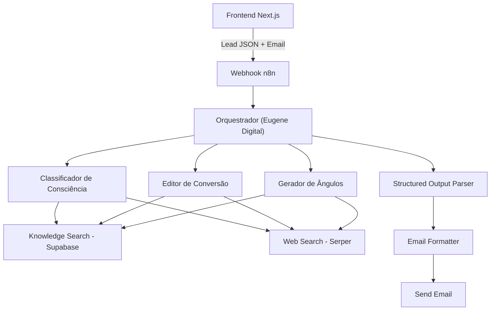
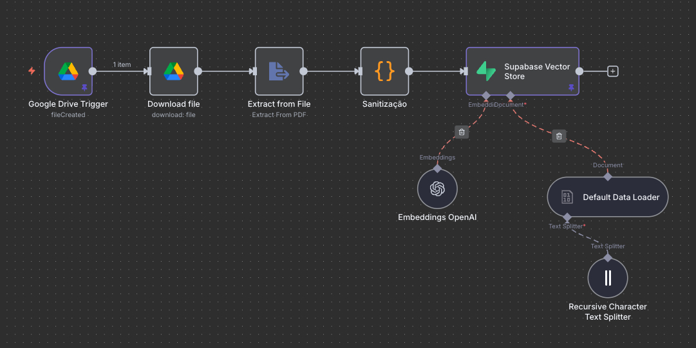
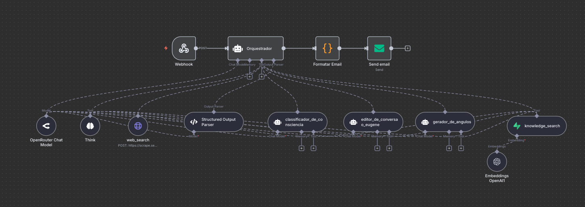

# 🧠 Clone Digital do Eugene Schwartz – Vitascience

### Index

- [Visão Geral](#-visão-geral)
- [Estrutura da Entrega](#-estrutura-da-entrega)
- [Arquitetura](#-arquitetura)
- [Workflows](#-workflows)
- [Documentação dos Prompts](#-documentação-dos-prompts)
- [Estrutura do Banco de Dados](#-estrutura-do-banco-de-dados)
- [Validação e Testes](#-validação-e-testes)
- [Como Rodar](#-como-rodar)
- [Tecnologias e Ferramentas](#-tecnologias-e-ferramentas)

---

## 📌 Visão Geral

Este repositório contém a entrega do **Teste Prático: Vaga IA + Automação** para a Vitascience.

Objetivo: construir um sistema capaz de **analisar e melhorar leads de VSLs** segundo os princípios de Eugene Schwartz (*Breakthrough Advertising*), gerando uma análise estruturada em **JSON** com:
- Nível de Consciência (1–5)  
- Framework predominante (AIDA, PAS, 4Ps, Story)  
- ≥ 5 melhorias concretas  
- ≥ 3 novos ângulos criativos

---

## 🗂 Estrutura da Entrega

- **`/workflow`** → Workflow do n8n exportado em JSON  
- **`/prompts`** → Documentação dos prompts usados (Classificador, Editor, Angles, Orquestrador)  
- **`/database`** → Estrutura SQL usada para armazenar embeddings e histórico de análises  

---

## 🏗️ Arquitetura



---

## 🔄 Workflows

### 1. 📚 Vetorização do Livro (*Breakthrough Advertising*)


- **Objetivo:** processar e armazenar o livro do Eugene Schwartz no banco vetorial (Supabase).  
- **Passo a passo:**
  1. **Google Drive Trigger** → dispara quando o PDF é adicionado à pasta.  
  2. **Download File** → baixa o arquivo.  
  3. **Extract from File** → extrai o texto do PDF.  
  4. **Sanitização** → remove ruídos e organiza o conteúdo.  
  5. **Text Splitter** → quebra o texto em *chunks* menores.  
  6. **Embeddings OpenAI** → gera vetores de cada chunk.  
  7. **Supabase Vector Store** → armazena `content`, `metadata` e `embedding` na tabela `documents`.  

⚠️ Esse fluxo foi usado **apenas uma vez** para preparar a base vetorial.

### 2. 📨 Análise de Lead


- **Objetivo:** receber uma **Lead de VSL** do frontend, passar pelos agentes de IA e retornar a análise final.  
- **Passo a passo:**
  1. **Webhook** → recebe a requisição do frontend.  
  2. **Orquestrador (Eugene Digital)** → coordena os demais agentes, valida com RAG e monta o JSON final.  
  3. **Classificador de Consciência** → identifica nível (1–5) e framework (AIDA, PAS, 4Ps, Story).  
  4. **Editor de Conversão** → gera ≥5 melhorias estruturadas.  
  5. **Gerador de Ângulos** → cria ≥3 ângulos criativos para diferentes níveis.  
  6. **Knowledge Search (Supabase)** → consulta a base vetorial do livro.  
  7. **Web Search (Serper)** → abre apenas os links explícitos presentes na lead.
  8. **Structured Output Parser** → força os agentes a sempre retornarem no **formato JSON válido**, evitando erros de sintaxe ou campos ausentes.    
  9. **Formatar Email** → organiza o resultado em formato legível.  
  10. **Send Email** → envia a análise final para o usuário.  

🚀 Esse fluxo é o **core do sistema**: garante que cada análise seja processada em background e entregue por email.

---

## 📑 Documentação dos Prompts
Os agentes principais implementados foram:  
- **Classificador de Consciência** → identifica nível e framework  
- **Editor de Conversão** → diagnostica melhorias  
- **Gerador de Ângulos** → cria headlines por níveis distintos  
- **Orquestrador** → unifica e valida JSON final  

👉 Cada prompt está documentado em `/prompts`.


### 📑 Racional dos Prompts

| Agente | Objetivo | Estratégia usada | Por que é importante |
|--------|-----------|------------------|----------------------|
| Classificador de Consciência | Identificar nível (1–5) e framework | Usa 1x `knowledge_search` e limita frameworks a {AIDA, PAS, 4Ps, Story} | Restringe o espaço de resposta, garantindo foco em frameworks consagrados e consistência na avaliação. |
| Editor de Conversão | Gerar ≥5 melhorias práticas | Estrutura issue → why → how Eugene → exemplo reescrito | Força clareza, aplicabilidade e evita respostas genéricas |
| Gerador de Ângulos | Criar ≥3 headlines para níveis distintos | Sempre variar níveis (ex. 2, 3, 5), headlines ≤16 palavras | Garante diversidade de ângulos, respeitando Schwartz |
| Orquestrador | Unificar saídas no JSON final | Structured Output Parser + validação contra schema | Evita erro de formato e garante entrega consistente |

> 🧠 *Nota:* A estrutura de prompts utilizada neste projeto (🎯 Goal → 🧠 Think Steps → 📤 Formato de Saída) segue as boas práticas de engenharia de prompts defendidas por **Greg Brockman**, presidente da **OpenAI**.
> Esse modelo garante **clareza**, **consistência** e **rastreabilidade** nas respostas, assegurando outputs sempre estruturados.


---

## 📊 Estrutura do Banco de Dados

- **Tabela `documents`** *(única e obrigatória)*  
  Armazena os **chunks vetorizados** do *Breakthrough Advertising* (conteúdo, metadados e embedding).

### Estrutura das colunas
- `id BIGINT PK` — identificador do chunk  
- `content TEXT` — texto do chunk  
- `metadata JSONB` — informações flexíveis (ex.: `{"source":"breakthrough_advertising.pdf","page":37,"section":"Levels of Awareness"}`)  
- `embedding VECTOR` — embedding gerado (pgvector)

> **Observação:** Tabelas como `analyses` (histórico de análises) e `leads` (entrada bruta da lead) são **opcionais** e podem ser adicionadas depois.  
> Neste MVP, o sistema consulta apenas `documents` via RAG.

---

## ✅ Validação e Testes
- **Critérios de qualidade usados neste teste:**  
  - JSON sempre válido  
  - ≥5 melhorias  
  - ≥3 ângulos distintos  
  - Justificativas sempre ancoradas nos princípios de *Breakthrough Advertising*  
  - IA reforça suas decisões consultando trechos vetorizados do livro (*RAG*)  

> ⚠️ **Observação:** Esta abordagem foi desenhada especificamente para o **teste prático**.  
> Em um cenário de **produção real**, eu iria:  
> - Utilizar **leads históricas de alta conversão** da base da Vitascience como *ground truth*.  
> - Empregar o **Node Evaluation do n8n** para medir a qualidade das novas análises.  
> - Comparar resultados atuais com padrões já **validados empiricamente** (conversão real).  
> - Criar um ciclo de feedback contínuo para calibrar os agentes com base em métricas objetivas.  

---

## 🚀 Como Rodar

### 🌐 Teste online

- https://vitascience-teste-pratico.vercel.app/

### 🌐 Teste local

```bash
🎨 Configuração do Frontend

# **Clone o repositório**
$ git clone https://github.com/eduvarjaor/vitascience-teste-pratico.git

# Acesse a página do projeto
$ cd vitascience-teste-pratico

# Instale dependências
$ npm install

# Configure as variáveis de ambiente seguindo o modelo do arquivo .env.example

# Execute o projeto em modo de desenvolvimento
$ npm run dev

# O servidor será iniciado na porta 3000 — acesse em: http://localhost:3000

-------------------------------------------------------------------------------------

⚙️ Configuração do Backend

1. Baixe o **template do workflow** disponível na pasta `workflow/`.  
2. No painel do **n8n**, vá em **Import** e carregue o arquivo `.json` do workflow.  
3. Configure suas **credenciais** (APIs, banco de dados etc.).
4. Coloque o fluxo em modo de produção, copie a URL do webhook gerado e defina essa URL como variável de ambiente no frontend.  
```

---

## 🛠️ Tecnologias e Ferramentas
- [**Next JS**](https://nextjs.org/) → Frontend
- [**n8n**](https://n8n.io/) → Orquestração principal  
- [**LLM**](https://openrouter.ai/) → Deepseek-R1  
- [**Supabase**](https://supabase.com/) → Banco de dados + armazenamento de embeddings  
- [**OpenAI Embeddings**](https://openai.com/) → Vetorização do livro *Breakthrough Advertising*  
- [**Serper**](https://serper.dev/) → Leitura de URLs explícitas da lead 

---

Made with 💙 by eduardocodes 👋